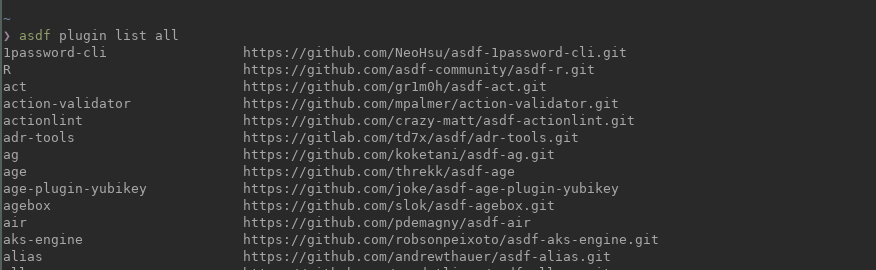
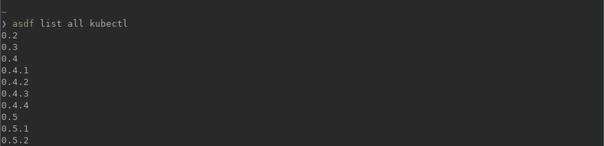
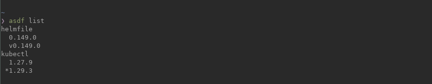
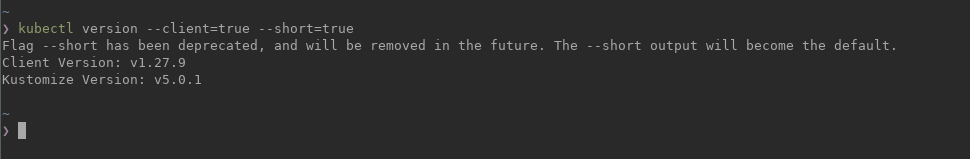
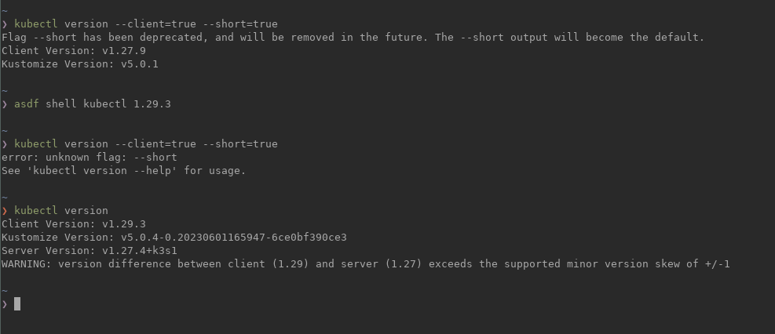

# asdf-manage-guide

With ASDF you can switch between versions whenever you want, set that version at three stages: Global, Local and Shell.

Are you interested? OK! Then you should try it. Download you release from it's official Github page: https://github.com/asdf-vm/asdf

You will need to clone the repo:

```zsh 
git clone https://github.com/asdf-vm/asdf.git ${HOME}/.asdf
```


And then add that path to your $PATH:

```zsh 
export PATH=$PATH:${HOME}/.asdf
```

Now you need to update the plugin list:

```zsh
asdf plugin list all
 ```



We want to install Kubectl so let's check which versions are available:

```zsh
asdf list all kubectl
 ```



Mmm... lot of them, so lets install 1.27.9 version and 1.29.3:

```zsh 
asdf install kubectl 1.27.9
```
Check established packages:

```zsh 
asdf list
```


Select a package version:

```zsh 
asdf shell kubectl 1.27.9
```





unistall:

```zsh
 asdf uninstall kubectl 1.27.9 
 ```